# YOGA

## [Click here to view website](https://iainjackson90.github.io/pp1-yoga/)

YOGA is a site that will help people to find a place of relaxation after a long
day.
It is a place where you can experience to be mindful and present in the moment,
a place to connect with nature or just relax in a sauna.
We have many facilities available to be used at your own discretion.

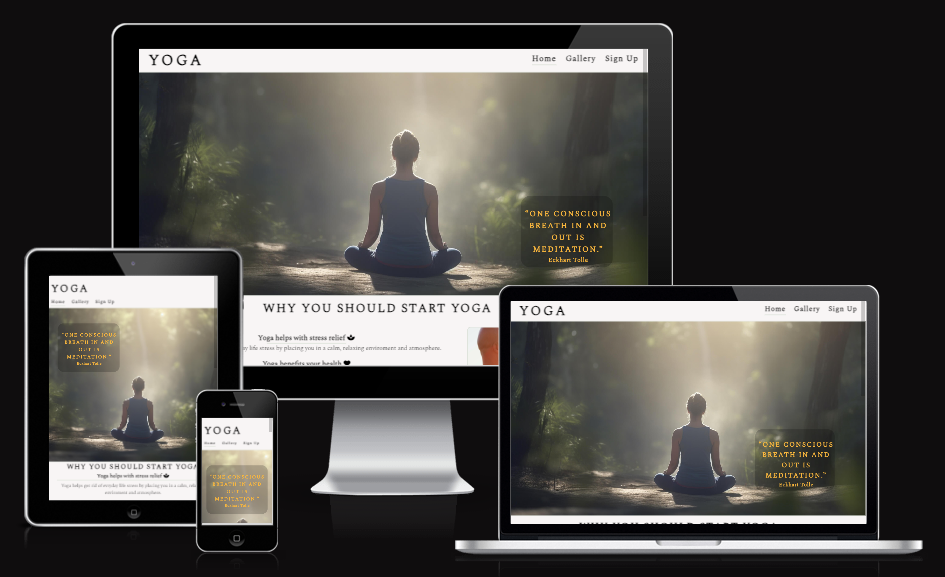

# UX

When the user loads the webpage you will be introduced by a descriptive logo and landing image that immediately sets the mood of the webpage.
The cover text on the landing image has a breathing affect and a comment of breathing, it will subconsciously get you thinking about your breathing.
The color theme of the webpage is designed to be soft and relaxing giving you a feeling of space and time and that there is no rush, it sets a peaceful ambiance.
all the navigation is designed to be smooth and user friendly in a stress free environment leading up to the signup form.

## Wireframe

For the layout of the web page I went with a simple design having a user friendly experience in mind.The design has deviated from the original wireframe design as new ideas came to mind as well as making it more responsive.
The design of the thank you page was only thought of after.

_Main Page_

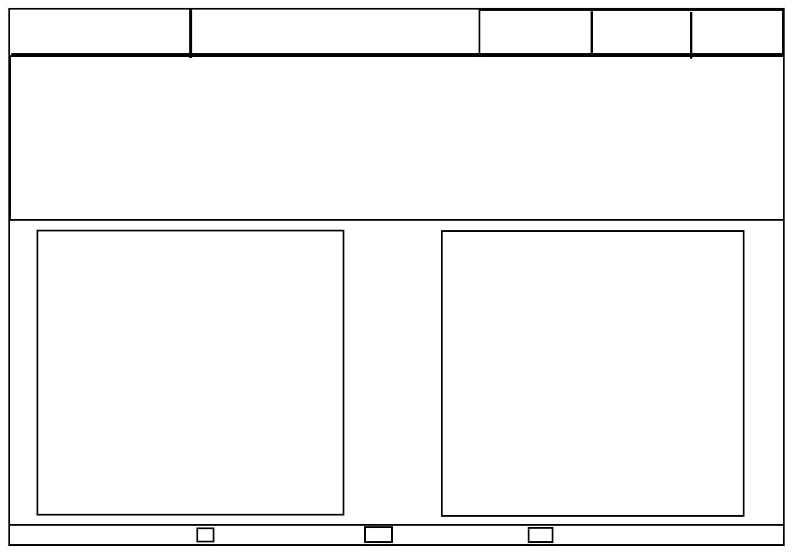

_Gallery_

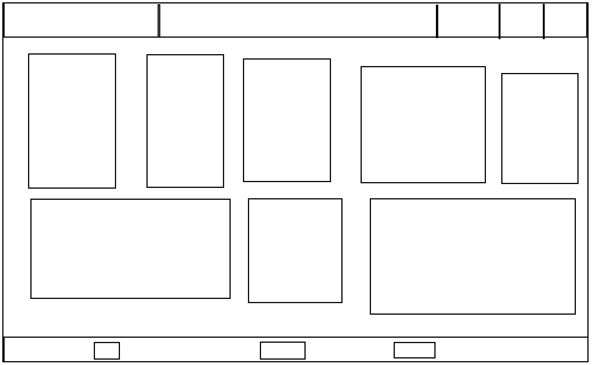

_Sign Up_

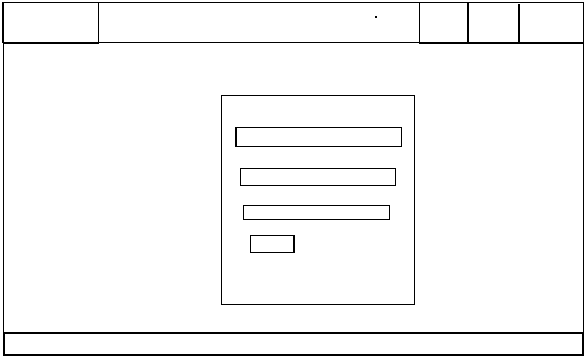

## Colors uesd for the webpage

This is the colors I chose to use for the website

This is the color pallet of the website 

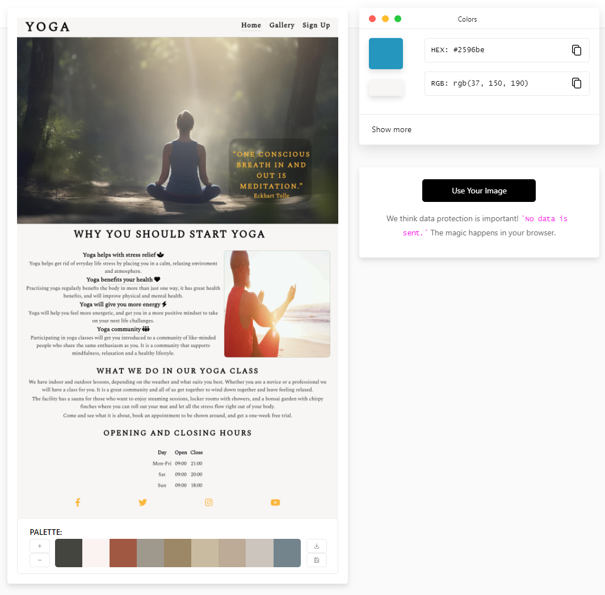

# Features

The website is designed to be user friendly, simple and responsive.

## Existing Features

- _Logo_

  - The logo is a link to the home page , displayed on each page of the webpage.
  - It is intended as a home panic button

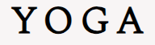

- _Navigation Bar_

  - The navigation bar has links to three pages to make navigating trough the
     website simple.
  - The navbar is displayed on the top right on larger screen sizes and displayed
    underneath the logo on smaller screen sizes
  - Each page has the navigation bar except the thank you page
  - When hovering over the navigation bar the text font will increase in size to
    make it visually more simple to see which page you want to select
  - The nav bar will also have a underline to show which page you are currently
    viewing.  

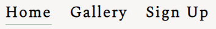

- _Landing page image_

  - The landing page is picture about capturing peace and being mindful and in
    the moment setting the mood for the website
  - It also will give an idea of what the content of the website is about

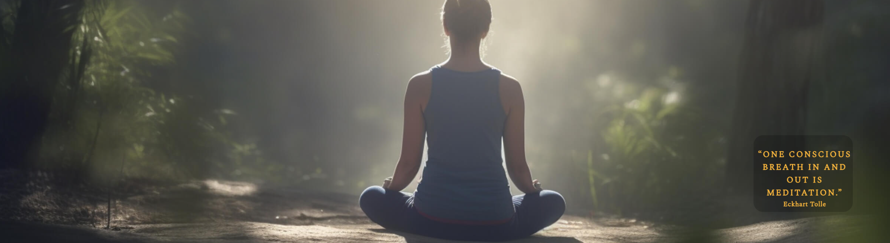

- On Top of the landing page image is a animation that does a breathing effect
    trying to simulate a deep breath in and a long breath out.
- the animation is on the bottom right on larger screen sizes and will move
    to the top left on smaller screen sizes

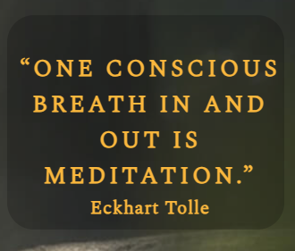

- _Why you should start YOGA section_

  - This section is about good health benefits you will start to feel
  - it gives the user a idea of what to expect when they do yoga
  - it will provide useful information to the user if yoga is what hey are looking to do

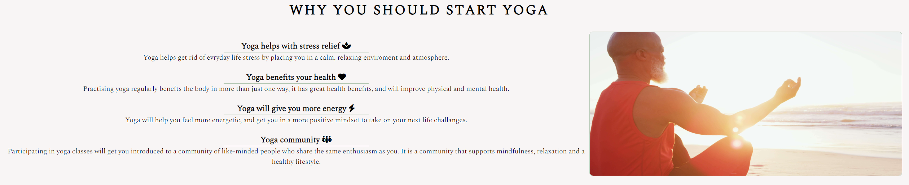

- On the right of the content is a picture, on larger screens it will display on the right
    and on the smaller screen sizes it will display underneath the "why you should start yoga"
    section

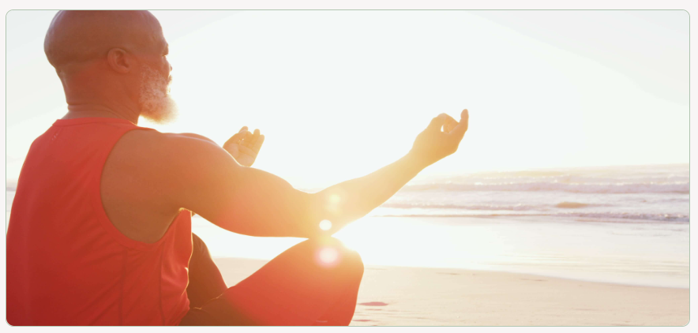

- _Facilities and Operating hours_

  - This section will provide information to the user of what they can expect to find
    when they join the classes
  - It will also display a table of operating hours

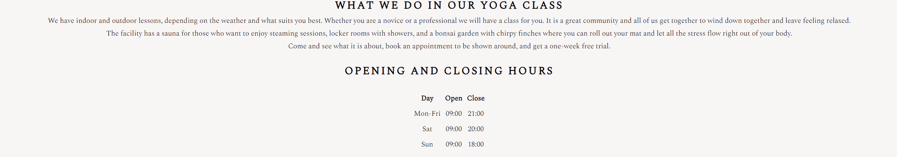

- _The Footer_

  - The footer is available on each page
  - The footer has social media links
  - The social links has a pop up animation when you hover over them to give a button feeling

- _Gallery_

  - The gallery will have images of what the classes will look like
  - this section will provide the user with visual content describing what to expect
  - The gallery is responsive and will arrange content dependent on screen size

  

- _Sign Up Page_

  - This page gives the user an opportunity to sign up for a class other indoor
    or outdoor classes
  - it also contains contact information for the user if they feel to get in touch
    for any additional information
  - This page will not accept the wrong input type
  - the join button will pop up and change color when you hover over it
  - when completing the form it will direct you to a thank you page

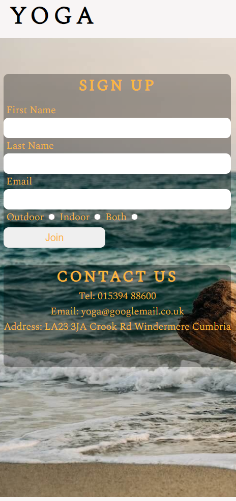

- _Thank You Page_

  - This page will have a thank you message for the user
  - it will have a home button to direct the user back to the home page
  - the button will have a pop up effect when you hover over it

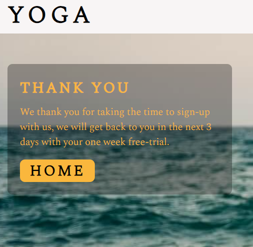

- _Features left to implement_

  - Have live online YOGA classes
  - Have a motivational mindfulness content section
  - Have a comment section where users can rate their classes

# Testing

While building the webpage i have encountered some bugs:

- _Bugs I Encounterd_

  - Nav Bar

    - The navigation bar did not display in the order it was intended or in the order
       I have placed them in the html page.
       I fixed this by placing the nav bar into a flex-box, it changed the order
       to how I intended it to be.

  - Hero image

    - The hero image is a large size which has a impact on the performance, i have
       made a conscious decision to keep it this way for quality of the image and also
       the image fit the content of this page very well
    - The hero image looked very dull over the background so i added a thin border to make
       it stank out more to give it contrass

  - why you should start yoga
    - The content and image I had in  two separate divs and struggled to get the content
       and picture to work correctly together with sizing when i change screen sizes,
       I found placing both of the divs into a flex-box i manage to get the content
       and the picture be responsive to the idea i had.
    - The Picture is not displayed in the native resolution it is a bit stretched
       and causes a performance issue, I feel the image does not look visually unpleasing
       and i need it to be the size it is to fit the content.

  - Gallery

    - The gallery images was overflowing into the head of the page,
       I fixed it by giving the head of the page a fixed height and a margin bottom
       which pushed all the gallery images down away from the head of the page

  - sing Up Form

    - The sign up form had some contrast problems so i gave the div a transparent
       dark background so the user can see the content better and not take away the
       ambiance of the background

## Manual Testing

| What was tested | Result |
|:---:|:---:|
|Home page navigation bar was used - navigate through website|Worked like it was intended to|
|Logo was clicked on each page - brings you back to home page|worked like it was intended to do|
|Social media links - Opens up in a new tab|Worked like it was intended to|
|Form inputs - Would not accept the wrong input or no value|Worked like it was intended to
|Thank you page home link - Send you back to the home page|Worked like it was intended to

# Validator Testing

I put the website through a series of validators to make sure it conforms to a valid
standard here are the tests and results

## [HTML Validattor](https://validator.w3.org/)

All the html pages was validated and had noe errors, only had warnings about
the comments i left in the purposefully to help navigate through the code easier

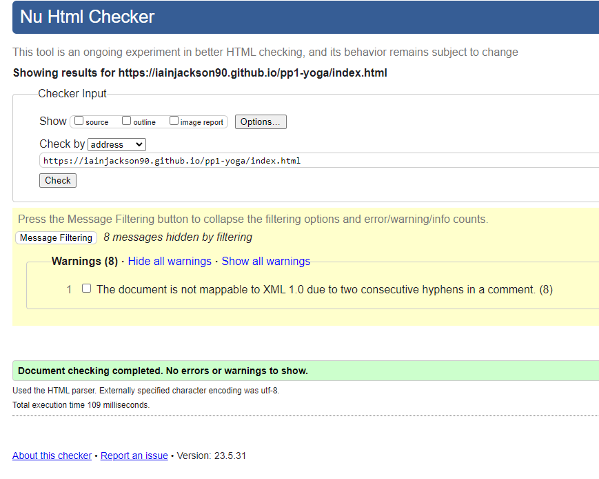

## [CSS Validator](https://jigsaw.w3.org/css-validator/)

All CSS has been validated and is free from errors

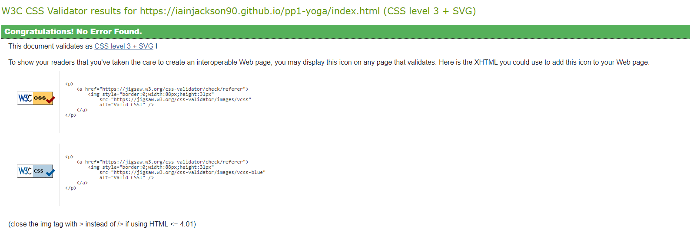

## Lighthouse testing for desktop

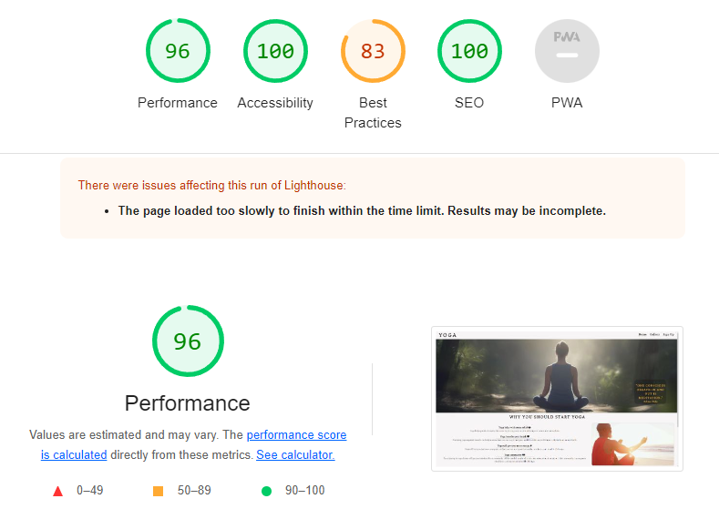

## Lighthouse testing for mobile

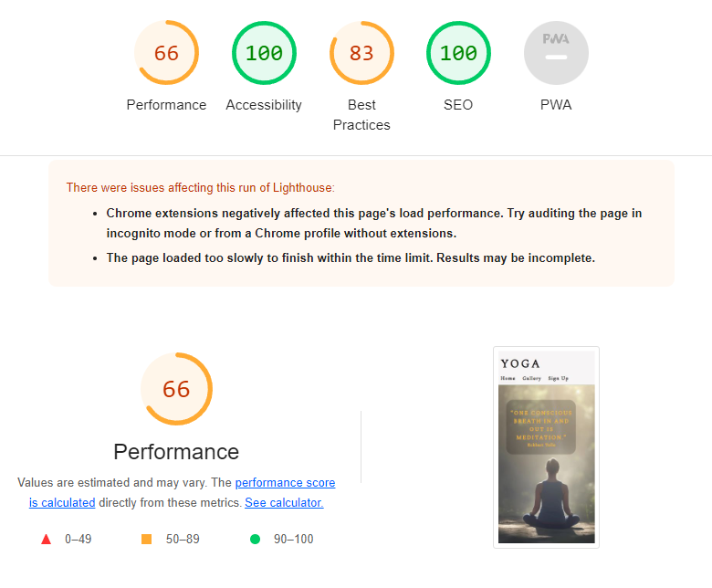

## [Contrast Validator](https://color.a11y.com/)

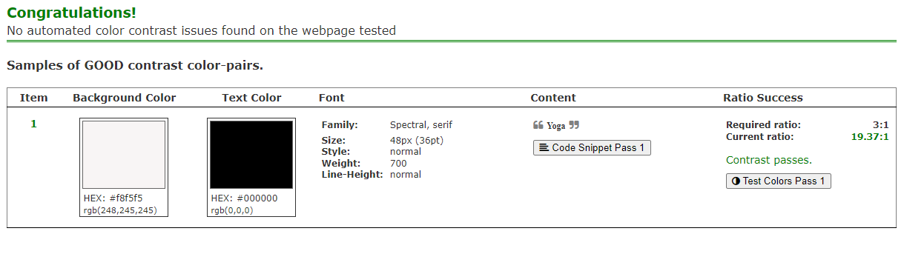

# Deployment

This site was deployed to GitHub and these are the steps that was taken to do so:

1. Log into GitHub
2. Navigate to repository (Left top corner)
3. Select the project  (The top let corner)
4. Settings (Nav bar at the top)
5. Pages (Left side menu)
6. Branch(Select main and folder as Root)
7. Save

Wait a while for it GitHub to deploy the webpage, when it is done it wil show
the link at the top

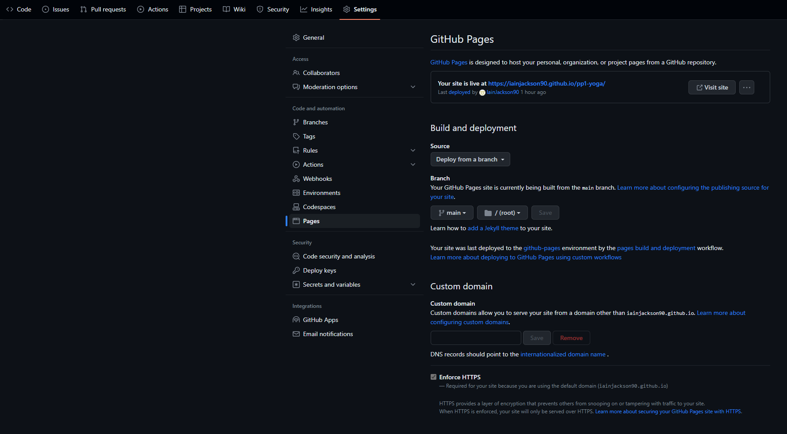

- ## _Cloning the GitHub repository_

This will download a full copy to your desktop

1. Log into GitHub
2. Find the repository you wish to clone
3. Find the green code button top right corner
4. Select "Local", copy the HTTPS URL
5. Go to Codeanywhere and navigate to "New Workspace"
6. Paste the URl into the space provided
7. Click "Create"

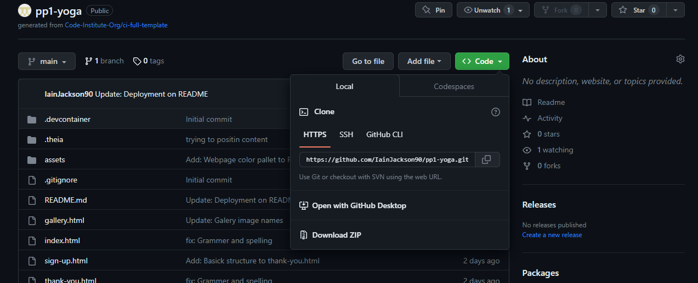
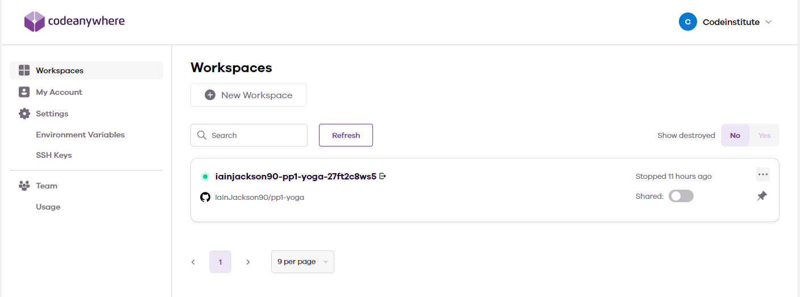

- ## _Forking the GitHub repository_

Will allow you to create a copy of the repository so changes can be made that will not affect the original repository.

1. Log into GitHub
2. Find the repository you wish to fork
3. Find the "Fork" drop down in the top right corner second from last
4. Select "Create"  

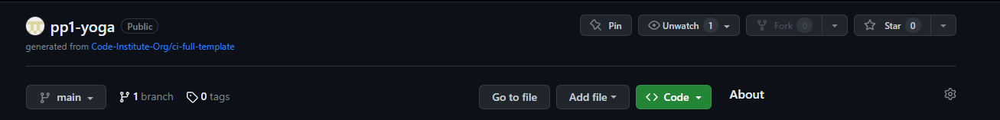

# Technologies Used

- Html
- Css
- [Google Fonts](https://fonts.google.com/)
- Chrome dev tools
- [TinyPNG](https://tinypng.com/)
- [Font Awsome](https://fontawesome.com/)
- [Coneanywhere](https://codeanywhere.com/)
- [GitHub](https://github.com/)
- [Color Contrast Accessibility Validator](https://color.a11y.com/)
- [W3C Markup Validation](https://validator.w3.org/)
- [W3C CSS Validation](https://jigsaw.w3.org/css-validator/)
- [FREEFORMATTER](https://www.freeformatter.com/)  For HTM and CSS
- [Am I Responsive](https://ui.dev/amiresponsive)
- [fakexy](https://www.fakexy.com/ )
- [Google Docs](https://docs.google.com/document/u/0/)
- [imagecolorpicker](https://imagecolorpicker.com/)
- [coolors](https://coolors.co/)
- Microsoft Paint
- Snipping Tool

# Credits

- Code Institute for the learning content provided
- Harry Dhillon my assigned mentor to give advise on the project
- Nicole Jackson my wife a student at code institute for constructive criticism
- Slack community
- [w3schools](https://www.w3schools.com/) for guidance about hero image and table design
- [stackoverflow](https://stackoverflow.com/) for guidance about Flex bob
- [Kevin Powell](https://www.youtube.com/watch?v=6yAAV-uP0po&t=275s) for guidance about flex box
- [Kevin Powell](https://www.youtube.com/watch?v=6yAAV-uP0po&t=275s) for guidance to resize images

## Content

- Font from this webpage was taken from Google Fonts "Spectral"
- The icons on the page was taken from Font Awesome
- [SUSANNE RIEKER](https://susannerieker.com/10-color-schemes-for-your-wellness-or-yoga-website/) Theme   color inspiration
- [Motherhood Community](https://motherhoodcommunity.com/20-quotes-that-will-make-you-want-to-breathe-more-deeply-and-intentionally/) for the mindfulness quote
- [HipFonts](https://hipfonts.com/yoga-fonts/?expand_article=1) inspiration of font style
- [FLORIN POP](https://www.florin-pop.com/blog/2019/03/css-pulse-effect/) guidance for Cover text breathing effect
- [hopkinsmedicine](https://www.hopkinsmedicine.org/health/wellness-and-prevention/9-benefits-of-yoga) guidance on health benefits of YOGA

## Media

- _Picks found on_

  - [Vecteezy](https://www.vecteezy.com/)
  - [freepik](https://www.freepik.com/)
  - [Unsplash](https://unsplash.com/)
  - [PIKWIZARD](https://pikwizard.com/)
  - [rawpixel](https://www.rawpixel.com/)
