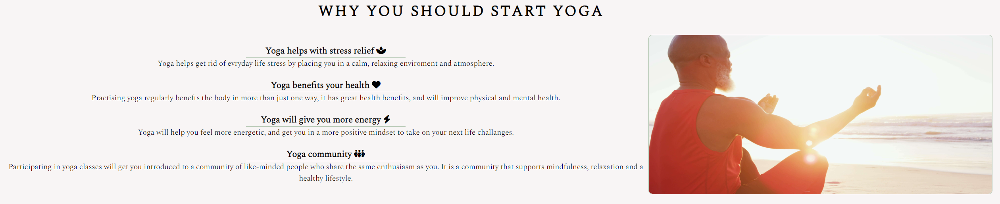

# YOGA

## [Click here to view website ](https://iainjackson90.github.io/pp1-yoga/)

YOGA is a site that will help people to find a place of relaxsation after a long
day.
It is a place where you can experiance to be mindfull and present in the moment, 
a place to conect with nature or just relax in a sauna.
We have many facilities avalable to be used at your own descretion.

## Features

The website is designed to be user friendly, simple and responsive.

## Exsiting Features 

- _Logo_

  - The logo is a link to the home page , displayed on each page of the webpage.
  - It is intended as a home panic button

    
- _Navigation Bar_
  
  - The navigation bar has links to three pages to make navigating trough the 
     website simple.
  - The navbar is displayed on the top right on larger screen sizes and displayed
    underneath the logo on smaller screen sizes
  - Each page has the navigation bar exept the thank you page
  - When hoveriong over the navigation bar the tex font will increas in size to
    make it visualy more simple to see whitch page you want to select
  - The nav bar will also have a undrline to show whitch page you are currently
    viewign.  
   

- _Landing page image_
  
  - The landing page is picture about capturing peace and being mindfull and in 
    the moment setting the mood for the website
  - It also will give an idia of what the content of the website is about 
    

    
  - Ontop of the landing page image is a animation that does a breathing efect
    trying to simulate a deep breath in and a long breath out.
  - the animation is on the bottom right on larger screen sizes and will move 
    to the top left on smaller screen sizes
    

- _Why you should start YOGA section_

  - This section is about good health benifits you will start to feel 
  - it gives the user a idia of ehat to expect when they do yoga
  - it will provide usifill information to the user if yoga is what hey are looking to do
 

    
  - On the right of the content is a picture, on larger screens it will display on the right
    and on the smaller screen sizes it will display underneath the "why you should start yoga"
    section

- _Facilities and Operating hours_
  
  - This section will provde infromation to the user of what they can expct to find
    when they join the classes
  - It will also disply a table of operating hours 

- _The Footer_
   
   - The footer is available on each page 
   - The footer has social meadi links 
   - The social links has a pop up animathin when you hover over them to give a button feeling

- _Gallery_
  
  - The gallery will have images of what the classes will look like 
  - this section will provide the user with visual content describing what to expect
  - The gallery is responsive and will arange content dependent on screen size 
  
  
   
- _Sign Up Page_

  - This page gives the user a opertunity to sing up for a class ither indoor
    or outdoor classes
  - it also contains contakt information fot he user if they feel to get in touch
    for any aditional information 

- _Features left to implement_
  
  - Have live online YOGA classes
  - Hvae a motivational mindfullnes content section
  - Have a coment section where users can rate there classes